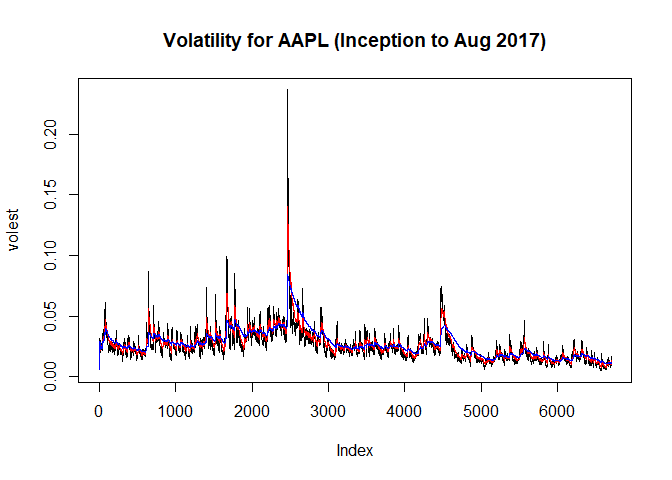

# Apple Volatility
Alvarado, Cynthia  
August 5, 2017  


## Download Data for Apple (ticker: AAPL)

Below, we save the close price for Apple since inception at December, 1980 to August, 2017. The log transformation is taken, then volatility is computed.  Note the Square root of 250 is taken, and denotes the number of trading days in a year, and is multiplied by 100 to show as a percent.


```r
#Get Data for Ticekr GWPH
AAPLdata <- get.hist.quote('AAPL',quote="Close")
```

```
## 'getSymbols' currently uses auto.assign=TRUE by default, but will
## use auto.assign=FALSE in 0.5-0. You will still be able to use
## 'loadSymbols' to automatically load data. getOption("getSymbols.env")
## and getOption("getSymbols.auto.assign") will still be checked for
## alternate defaults.
## 
## This message is shown once per session and may be disabled by setting 
## options("getSymbols.warning4.0"=FALSE). See ?getSymbols for details.
```

```
## 
## WARNING: There have been significant changes to Yahoo Finance data.
## Please see the Warning section of '?getSymbols.yahoo' for details.
## 
## This message is shown once per session and may be disabled by setting
## options("getSymbols.yahoo.warning"=FALSE).
```

```
## time series ends   2017-08-03
```

```r
#log close Price value
AAPLret <- log(lag(AAPLdata)) - log(AAPLdata)
#Volatility for GWPH
AAPLvol <- sd(AAPLret) * sqrt(250) * 100
```

## Volatility Function

Below, a volatility funciton is created.  Note the 'd' is used to calculate the weight of the series. 'Logrets' is the data calculated above, which is the log of the return (previous close price minus current day's close price).


```r
get
```

```
## function (x, pos = -1L, envir = as.environment(pos), mode = "any", 
##     inherits = TRUE) 
## .Internal(get(x, envir, mode, inherits))
## <bytecode: 0x000000000b695938>
## <environment: namespace:base>
```

```r
Vol <- function(d, logrets) #d is the weight (1 - (1/d)) and logrets is the log of returns
{
  var = 0  
  lam = 0
  
  varlist <- c()
  
  for (r in logrets) {    
    lam = lam*(1 - 1/d) + 1    
    var = (1 - 1/lam)*var + (1/lam)*r^2    
    varlist <- c(varlist, var)    
  }  #end of for loop
  sqrt(varlist)
}  #ends function
```

Using the function above, we use to calculate the volatility at 3 different weights. I used weights of 90%, 96.7% and 99%.


```r
#Volatility with weight of 90%
volest <- Vol(10,AAPLret)
#Volatility with weight of 96.7%
volest2 <- Vol(30,AAPLret)
#Volatility with weight of 99%
volest3 <- Vol(100,AAPLret)
```


## Including Plots of the Volatility

The plots to the three different volatilities is found below. The two subsequent weights are superimposed on the original of 90% weight.


```r
#plots the volatility at 90%
plot(volest,type="l", main = "Volatility for AAPL (Inception to Aug 2017)")
#superimposes line at 96.7%
lines(volest2,type="l",col="red")
#superimposes line at 99%
lines(volest3, type = "l", col="blue")
```

<!-- -->


From the plot above, you can see that the volatility of Apple, Inc. is pretty steady through time. An unusual high peak is observed with approximately 25% volatility.


